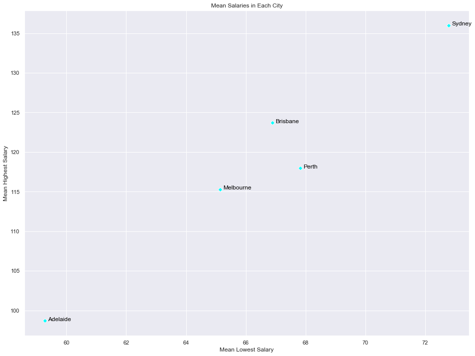
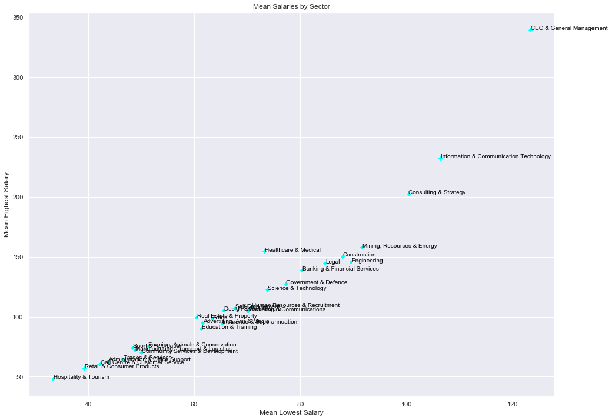
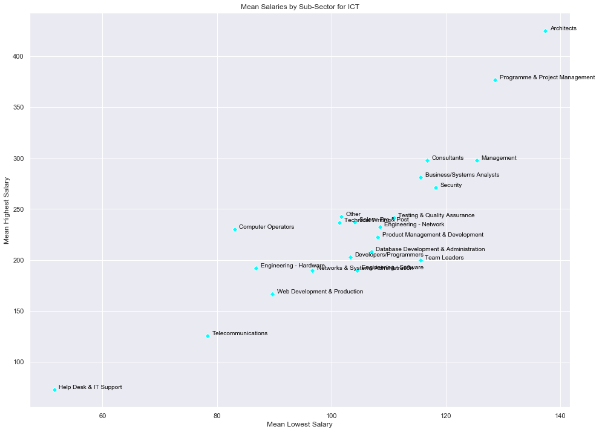
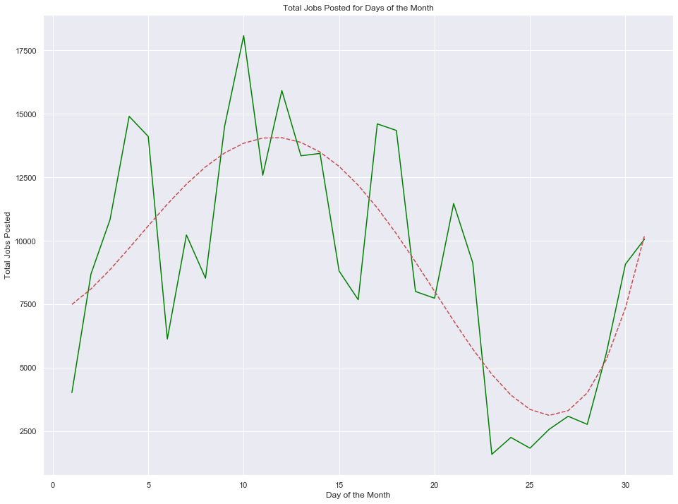

# Data Story

Job Market Size in Australia.

Job Market by Sector in Australia.

Job Market by Sector in Sydney.

Job Market by Sector in Melbourne.

Job Market by Sector in Brisbane.

Job Market by Sector in Perth.

Job Market by Sector in Adelaide.

Salaries in Australian Cities

Salaries for Job Sectors in Australia

Salaries for ICT Sub-Sectors in Australia

Patterns of Job Postings

